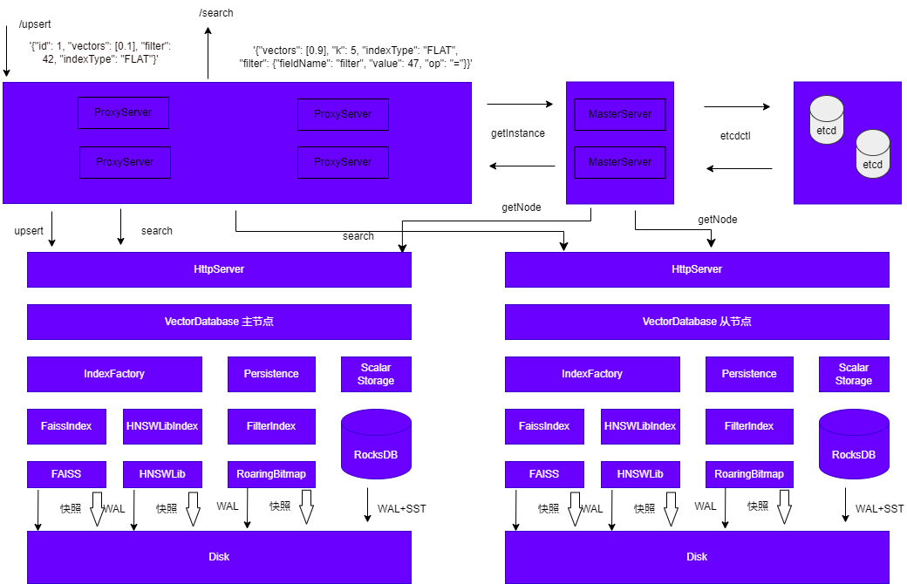
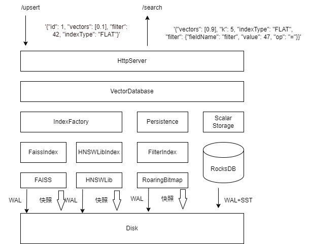

# vectorDB
分布式向量数据库


## v0.2 单机向量数据库



### v0.0.1
#### FaissIndex
系统中对扁平索引对象的封装，隐藏FAISS实现细节
#### IndexFactory
向量索引工厂类，进行向量索引生成和获取，支持扁平索引类型的索引
#### HttpServer
基于cpp-httplib实现，解析HTTP请求，调用对应索引执行具体操作，支持/insert和/search命令
#### GlobalLogger 
基于spdlog实现，提供日志记录能力，提升系统持续运营能力
#### VDBServer
main函数，服务的初始化和启动入口

-- 依赖 --

faiss
spdlog
rapidjson

编译得到libxxx.a文件

### 运行

```
./vdb_server
```

插入
```
curl -X POST -H "Content-Type: application/json" -d '{"vectors": [0.8], "id": 2, "indexType": "FLAT"}' http://localhost:8080/insert
```

查询
```
curl -X POST -H "Content-Type: application/json" -d '{"vectors": [0.8], "k": 2, "indexType": "FLAT"}' http://localhost:8080/search
```
返回结果：
```
{"vectors":[2],"distances":[0.09000000357627869],"retCode":0}
```

### v0.0.2
实现HNSW索引封装

依赖：hnswlib

插入
```
curl -X POST -H "Content-Type: application/json" -d '{"vectors": [0.2], "id": 3, "indexType": "HNSW"}' http://localhost:8080/insert
```

查询
```
curl -X POST -H "Content-Type: application/json" -d '{"vectors": [0.5], "k": 2, "indexType": "HNSW"}' http://localhost:8080/search
```

返回结果
```
{"vectors":[3],"distances":[0.09000000357627869],"retCode":0}
```

### v0.1
混合索引
- 基于RocksDB实现标量数据索引
    - `ScalarStorage`类
- `VectorDataBase`统一管理入口，组合向量数据和标量数据操作
- 扩展`upsert`、`query`接口

```
curl -X POST -H "Content-Type: application/json" -d '{"vectors": [0.2], "id": 3, "indexType": "FLAT", "Name": "hello", "Ci":1111}' http://localhost:8080/upsert
```

```
curl -X POST -H "Content-Type: application" -d {"id": 3}' http://localhost:8080/query
```

### v0.1.1
过滤索引

```
curl -X POST -H "Content-Type: application/json" -d '{"id": 6, "vectors": [0.9], "int_field":47, "indexType": "FLAT"}' http://localhost:8080/upsert
```

```
curl -X POST -H "Content-Type: application/json" -d '{"vectors": [0.9], "k": 5, "indexType": "FLAT", "filter":{"fieldName":"int_field", "value":47, "op":"="}}' http://localhost:8080/search
```

```
curl -X POST -H "Content-Type: application/json" -d '{"vectors": [0.9], "k": 5, "indexType": "FLAT", "filter":{"fieldName":"int_field", "value":47, "op":"!="}}' http://localhost:8080/search
```

### v0.1.2
数据日志持久化

### v0.2
数据快照持久化

组合快照机制和预写日志，使系统可以基于快照时间进行恢复重启

增加/admin/snapshot接口让管理员选择在合适的实际进行快照操作

实现过滤索引的序列化和反序列化

## 分布式向量数据库

### v0.3

- 建立主从关系
    - 自定义实现状态机和数据复制逻辑
    - Raft信息统一管理
    - HttpServer集成主从功能
- 实现数据复制

可能存在内存泄漏，暂未解决，运行前加入设置环境变量

`export ASAN_OPTIONS=alloc_dealloc_mismatch=0` 

运行：
`./vdb_server conf.ini`

提主：

`curl -X POST -H "Content-Type: application/json" -d '{}' http://localhost:8080/admin/setLeader`

查看节点信息：

`curl -X GET http://localhost:8080/admin/listNode`

写入数据

`curl -X POST -H "Content-Type: application/json" -d '{"id": 6, "vectors": [0.9], "int_field": 49, "indexType": "FLAT"}' http://localhost:8080/upsert`

读数据

`curl -X POST -H "Content-Type: application/json" -d '{"vectors": [0.9], "k": 5, "indexType": "FLAT", "filter":{"fieldName":"int_field","value":43, "op":"!="}}' http://localhost:8080/search`

加从节点：

`curl -X POST -H "Content-Type: application/json" -d '{"nodeId": 2, "endpoint": "127.0.0.1:9091"}' http://localhost:8080/admin/addFollower`

### v0.4

安装etcd

`https://github.com/etcd-cpp-apiv3/etcd-cpp-apiv3`

`sudo apt install etcd-server`


- 集群流量管理
    - 元数据管理
    - 统一的流量入口
        - 双缓冲数据更新
    - 读写分离

### v0.5
- 集群异常管理
    - 发现新主节点
    - 发现新故障从节点
    - 实现故障切换
# References
《从零构建向量数据库》